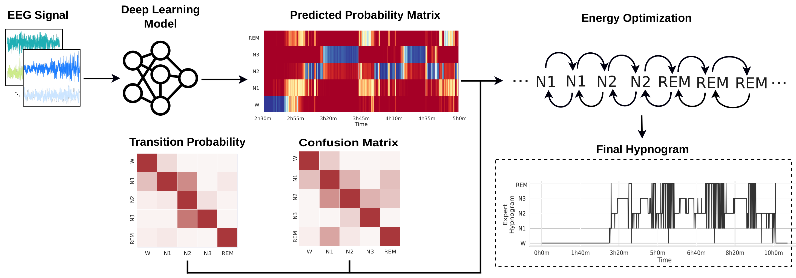

## Sleep-Energy: An Energy Optimization Method to Sleep Stage Scoring.

**Authors:** *Bruno Aristimunha, Alexandre Bayerlein, M. Jorge Cardoso, Walter Lopez Pinaya, 
Raphael Yokoingawa de Camargo.* 

**IEEE Access**, Accepted March, 2023.

### Abstract: 
Sleep is essential for physical and mental health. Polysomnography (PSG) procedures
are labour-intensive and time-consuming, making diagnosing sleep disorders difficult. Automatic
sleep staging using ML-based methods has been studied extensively, but frequently provides noisier
predictions incompatible with typical manually annotated hypnograms. We propose an energy
optimization method to improve the quality of hypnograms generated by automatic sleep staging
procedures. The method evaluates the system’s total energy based on conditional probabilities
for each epoch’s stage and employs an energy minimisation procedure. It can be used as a
meta-optimisation layer over the sleep stage sequences generated by any classifier that generates
prediction probabilities. Results show that it improves the accuracy of the predictions of 
state-of-the-art Deep Learning models using two public datasets.

---
### Quickstart

To execute the model, you can use the script `src/energy-model.py`.

**Parameters:**

    '--optparams', type=int, default=0,
    Set 1 to run the energy model with multiple alpha values and 0 for a single one (alpha = 0.5).

    '--part', type=int, default=0,
    Define the CV slice to optimize, between 0 and 5. Use -1 for all parts.

    '--model', type=str, default='usleep',
    Name of the neural network model ['stager', 'usleep', 'all']

    '--writefile', type=int, default=1,
    Set 1 to write results to files and 0 otherwise.

    '--dataset', type=str, default='edf',
    Name of the dataset to optimize ['edf', 'dreamer', 'all']

**Input files:**

`data/input_[dataset]_[model]_part_[0-4].pkl`

A pickle file containing a DataFrame `data_per_subject` with 5 columns and one line per subject and sleep session:

- subjects: a pair (subject, session) identifying the subject and session
- y_true: The hypnogram gerated by an specialist (target hypnogram)
- y_pred: The predicted hypnogram using the neural network `model`
- y_prob: The probabilities generated by `model` for each possible stage in each epoch
- train_test: Indicates if the hypnogram was used as part of the `train`, `valid`, or `test` sets

There is one file per `model` and `dataset`. Also, we used 5-fold cross-validation, and each `part` represents one fold.

**Output files:**

`sleep-results-[dataset].csv`: A csv file with multiple metrics, such as accuracy, f1-score,
precision, recall, and balanced accuracy. Each line contains the results for a single subject and sleep record,
in addition to parameter values and neural network model used for the predictions. 

`data/energy-[model]-[0-4]-[dataset]-opt.npz`: Contains numpy matrices with information from the energy-optimization
process, including the confusion and transition probability matrices, the target hypnograms, 
the hypnograms predicted by the NN, and the hypnograms optimized byt the energy model.
